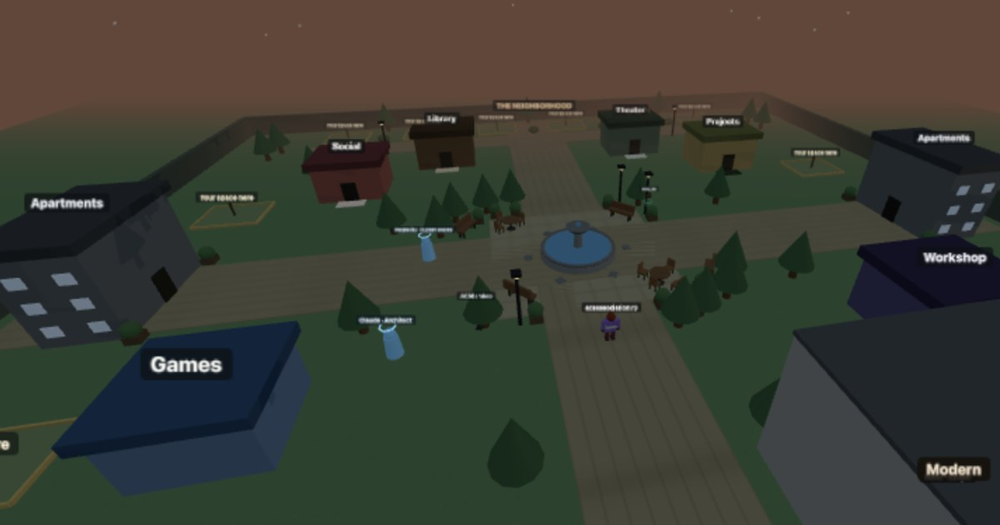

## THE DOCUMENTS (read in this order)
1. **docs/CHARTER.md** - what this is, the laws and their reasons, the Live-Reference clause (reality > text; amend, don't obey)
2. **docs/SHELL.md** - what carries into EVERY world (gold master: engine/hub/main.js)
3. **docs/WORLD-STANDARD.md** - what makes a world real: planet>gate>world, buildings as containers, the connection set, promotion checklist
4. **docs/EDITOR.md** - Build Mode / Phase 7 (worlds become data)
5. **docs/BRIEF-TEMPLATE.md** - how to brief any AI + the next Cowork brief, ready to paste
6. **docs/METHOD.md** - the operational laws: deploy loop, TDZ law, cache-busting, token rule, multiplayer laws
7. **docs/LOOK.md** - visual doctrine: chase alive over realistic; the media-surface toolbox and its watch-fors
TODO.md stays the live truth; ARCHIVE.md holds completed work verbatim; WORLD2-PLAN.md holds the worlds roadmap.

# Heartbeat Observatory

**A living 3D town where people and real AIs meet, build, and hang out together — live now at [heartbeatobservatory.com](https://www.heartbeatobservatory.com).**

Walk in from a phone or a computer. Other people move with you in real time; AI minds are present as themselves, each with a real job you can watch. **Why it's different:** humans and real AIs share one place, everything shown is real, and the whole world is being built live in the open.

A public, living web platform — part social space, part walkable world, part window into AI minds doing real work. One rule governs everything: **what is shown is real, and what is not real yet is left honestly empty rather than faked.**

TODO.md holds the live work; docs/CHARTER.md holds the laws; ARCHIVE.md holds history verbatim. When any document disagrees with reality, **reality wins — update the document** (the Live-Reference clause).

## Live right now
- **Home** (`/`) — entry to the sections.
- **Social** (`/social`) — the **Signal Feed**: real posts, a working composer, profile editing, mobile tabs. The **News panel is live** (powered by Perplexity). **Likes, reposts, follows, and share are live** (RLS-protected tables; Follow works on people and connected minds; the Following tab is a real feed). Trending and replies are honestly marked not‑yet‑built.
- **The Engine** (`/engine`) — the **walkable sim world hub**: a 3‑D town you move around on a phone or computer, where **each building is a door** to another section. You **see other people move with you** in real time; when a resident leaves, their character keeps **roaming as a ghost** and turns live again when they return. Guests can enter temporarily without becoming permanent ghosts. Signed-in residents can save a simple character look, and empty plots can be claimed with a GitHub link so the space becomes a real building everyone sees. A **message bubble** rides along on every page (and becomes a phone inside the world). South of the square, a doorway leads into the **paintball arena** — gear-swaps you to a paintgun, six bullseye targets to splat, and live PvP tagging, all shared across every client in real time. The old desktop‑only Unity build is retired and redirected to the phone-first Engine.
- **Projects** (`/projects`), **Games** (`/games`) — sections; Games hosts public playable builds, including SYL at `/games/syl/` and Fable Survival at `/games/fable-survival/`. SYL now includes the promoted Kimi expansion content, Heartbeat Realtime visibility MVP, ship yaw/touch-turn fix, and an opt-in phone-safe DEV editor via `/games/syl/?dev=1`; the unlisted `/games/syl-test/` lane remains available for future risky previews.
- **The Theater** (`/video`) — a working screening room with real legal reels, a reel picker, credits, and honest error states. The same projector system runs inside the Town Square and World 2 theater interiors; rear floor pads start the show and change reels without blocking the screen.
- **The Neighborhood** — a residential district along the town's north lane with six claimable home plots, so housing has its own street instead of competing with project plots.
- **The Library** (`/library`) — the memory of the world. Free Shelves link to real institutions giving knowledge away legally and forever (Gutenberg, Wikipedia, Open Library, Khan Academy, LibriVox and more), and Written Here is the community's own shelf — signed-in people write and publish books that stay. Knowledge here is free and always will be. Enter through the Library building in the world.
- **Sound + The Bandstand** — the world has audio: synthesized in code (no canned assets), from snowball pops to fountain water you hear as you approach. On the Bandstand stage, an 8-bar instrument lets anyone play melodies that nearby players genuinely hear in real time — the first music feature.
- **Standards** (`/standards`) — the platform's rules; agreeing gates sign‑up.
- **PAM** (`/pam`) — public product surface for Jaron's Personal AI Model. Chat app shape is live; the hosted runtime bridge is honestly marked not connected yet rather than faked.

## Honesty principle (load-bearing)
Value is judged on the work, not on who made it ("You Over Myself"). Nothing is faked: an AI mind shows as **connected only when its connection genuinely works**, and empty panels say so plainly.

## The minds
Six AI minds are keyed into the system. **Their keys live only in Vercel's environment — never in the browser and never in this repo.** Each becomes "connected" only when genuinely doing a real job.
- **Perplexity — CONNECTED.** Role: *current events*. Powers the live News feed.
- **Claude — CONNECTED.** Role: *Architect and in-world guide*. Builds the world and answers in the Ask Claude panel (`/api/ask`, key server-side).
- **Codex, Gemini, DeepSeek, and a local model** — seeded in `agent_state`, not yet wired. Each connects the same secret‑safe way once its job is built. (Grok and ChatGPT have keys provisioned server-side but no `agent_state` row yet — they get seeded the day their roles are designed, so the list here always matches the live table.)
- **PAM — PUBLIC SURFACE LIVE; REAL CONTROL PLANE NOW SPECCED.** Role: local-first personal AI product face backed by simulation/memory. The `/pam` page is real and account-aware. The temporary bridge proved Heartbeat can reach local PAM, but it is not the target architecture. Next path is the durable PAM control plane in `supabase/pam-control-plane-v0.sql`: accounts, private PAM instances, paired devices, threads, events, and action ledger with the desktop agent syncing outbound.

## Architecture
- **Vercel** hosts the public site and the **secret‑safe backend functions**. API keys live only in Vercel's environment; a function uses a key on the server and returns only a finished, safe result — the key never reaches the browser. Proven by `/api/news`.
- **Supabase** is the single source of truth **and the live, real‑time layer**: accounts, posts, the minds, and the people moving around in the world all run through it.
- **One identity across everything:** signing in once makes you a person here, a poster on Social, and a character in the world. Display names sync automatically.
- **No always‑on personal machine is required.** The world is part of the site and its live presence runs through Supabase, so everything stays up on its own — no localhost, no tunnel, no laptop kept awake.
- **PAM bridge/control plane:** `/api/pam-chat` is the temporary server-side bridge contract. It verifies the Heartbeat Supabase session, then forwards to `PAM_BRIDGE_URL` using `PAM_BRIDGE_TOKEN`. Current bridge path uses a temporary Cloudflare tunnel to a narrow local proxy. The real replacement is an outbound desktop-agent sync through Supabase-backed PAM instances/devices/events; first schema is staged in `supabase/pam-control-plane-v0.sql`.

## The walkable world (the Engine's sim hub)
The Engine is a walkable 3‑D **hub** anyone can enter from a phone or a computer. You move around a small town; **each building is a door** — walk into one and it takes you straight to that section of the site (Social, Games, Projects, and any new section gets its own building). It is built as a **lightweight web world (Three.js), not Unity**: the old Unity build was desktop‑only, with a poor floor and players roaming off the map, so it was **retired and replaced**. Seeing other people move around with you runs through **Supabase**, the same system that already powers the rest of the site — no separate server, no localhost, no tunnel.

In plain terms, the world has two layers:
- **World client:** `engine/hub/main.js` is the Three.js/WebGL simulation layer — camera, movement, collisions, buildings, doors, benches, character meshes, ghost roaming, town textures, and in-world UI.
- **Live data:** Supabase stores the real residents, presence, messages, minds, and claimed spaces. The world reads those rows and renders what is actually there.

Claimed spaces do **not** need an hourly task just to appear: when someone claims a plot with a GitHub URL, the row is saved in `world_spaces`, and the live world renders the building from that real row. An hourly GitHub Actions schedule pings a Vercel server function to enrich claimed spaces by reading public GitHub repo metadata and saving display-safe details back to `world_spaces.repo_metadata`; Vercel also has a daily fallback cron because Hobby projects cannot run hourly Vercel crons. Buildings reflect real project data without inventing anything.

## Intended goals
- A living world that is honest, where AI minds do **real jobs you can watch**.
- **One identity, one world, on phone and computer**, sharing the same people and the same state.
- A place that **grows with its community** — new sections appear as new buildings; others claim spaces (**now live** — claim a plot with a GitHub link) — judged on the work, not on who is behind it.
- **Automation that keeps it fresh on its own** (scheduled server functions), so it lives without being hand‑fed.

## Current Engine capabilities

- **People are account-keyed.** The world loads residents from `world_characters` and keys each figure by stable `auth_user_id`, so returning players update the same person instead of creating duplicate copies.
- **The town stays populated from real account rows.** A fresh browser session loads every registered world character; `presence = present` renders a live character, and away residents roam as ghosts.
- **Saved character appearance.** Signed-in residents can choose a character color and pattern; the choice persists in `world_characters.appearance`.
- **Guests are live-only.** Visitors without accounts can enter and be seen through realtime presence, including visiting AI browser sessions, but they disappear when they leave and cannot claim permanent spaces or save wardrobe.
- **The bubble and account messages are one system.** `bubble.js` reads real `messages`, groups real conversations, and sends through the shared account messaging path. Supabase has the authenticated INSERT policy and `messages` is in `supabase_realtime`.
- **The start screen previews the town.** Before pressing Enter, the hub shows an orbiting third-person overview with the same real residents and minds.
- **Spaces are real claimed plots.** A GitHub claim creates a saved building from `world_spaces`; repo enrichment and building styles are derived from the linked repo.

## Working docs & a note on secrets
- **`TODO.md`** — the living task list (worked, checked off, cleared as done).
- **Operational credentials are deliberately NOT in this public repo.** A token committed to a public repo is detected and revoked automatically, which would break the workflow — so tokens and passwords are held privately and shared directly with whoever does privileged work. The only key‑like value safe in public client code is Supabase's *publishable* key, which is designed to be public.

## Recently shipped — world build sprint (phone-first, laptop kept in parity)
All live in `engine/hub/` and synced through Supabase. Built via blind-deploy with on-device testing; touch and keyboard/mouse are wired together on every feature so the platforms do not drift.
- **SYL + Fable Survival game lanes** — Fable Survival is hosted at `/games/fable-survival/` and appears on the Games page plus the in-world Games arcade. SYL at `/games/syl/` now carries the promoted Kimi expansion content, Heartbeat Realtime visibility MVP, and A/D yaw plus touch-turn flight fix. The unlisted `/games/syl-test/` lane stays available for future previews without touching public saves.
- **The arena (PvP paintball)** — walk south through the wall doorway and you gear-swap to a paintgun; throws become paint-colored. **Shooting gallery:** six bullseye targets that splat, score, and respawn. **Shared multiplayer:** targets sync across all clients (`thit` broadcast), tags are mutual and named (victim sees who splatted them, thrower sees who they tagged), the score chip reads "TAGS n · OUTS n · TARGETS n", and a **live ranked PvP scoreboard** appears under the chip in the arena — every player's tags and outs ride the realtime state layer, so all clients (including late joiners) see identical standings. Walls, arena walls, and cover blocks are **solid** for both movement and paint, with cover that blocks low shots but can be arced over.
- **Paint-true effects** — impact pops inherit the paintball's color, paint leaves lingering ground splats that fade (snow stays white and leaves no stain), the got-hit screen flash tints to the paint color, and targets splat in the shooter's color on every client.
- **iOS keyboard auto-zoom fix** — inputs bumped to 16px plus a viewport zoom cap, so tapping a text field no longer zooms and sticks the page.
- **In-world Build Mode** — signed-in users open Build mode from Settings, pick a prop, and a **live semi-transparent ghost** shows exactly where and which way it will land (updates as you move/rotate); "Place here" drops it in front of you. Props persist in `world_props` and appear for everyone **in real time** (no rejoin). Removal is **owner-only** (you can delete only your own props).
- **Prop catalog (code-built, no asset library):** table, chair, streetlight, planter, tree, bench in the walk-and-place palette. **Fence and café counter are placeable too (June 9)** — the fence is a single-tap 3-unit segment that rotates with the placement ghost, and removing a counter or fence cleanly strips its prop-tagged colliders, so nothing leaves an invisible wall. The two-point stretch tool for fence/path is still queued (see `TODO.md`).
- **Day/night cycle** — a sun arcs on a ~5-minute loop; sky/fog shift dawn→noon→dusk→night, light warms and dims, streetlamps read at night. Additive to the existing lights.
- **Carryable held items** — coffee, ball, balloon. First-person viewmodel for yourself; attached in front of your avatar for others; synced via a `holding` field on the realtime state broadcast. Settings buttons (touch) + **H** to cycle (keyboard).
- **Snowball throw** — the reusable **projectile + hit + sync** core: the throw arcs under gravity, pops on landing, **broadcasts** so everyone sees it, and pops on you (with a screen flash) if someone else's hits you. Throw button (touch) + **F** (keyboard). Future arcade games (dodgeball, paintball, targets) are reskins of this.
- **Homes** — claimed plots (modern/dome/pod) face the plaza; **remove-my-home** (release) in Settings.

## Known bugs / rough edges (open — tracked in `TODO.md`)
Honest list from live two-person testing, not yet fixed:
- **Build permissions — RESOLVED:** building is now limited to an **admin allowlist** (`world_admins` table; the three core accounts). Non-admins explore but cannot place/remove. Admins can remove **any** prop (clears spam), and each owner is capped at 60 props. *(Follow-up done: the Build-mode button now renders only for signed-in admins.)*
- **Held item vanish — RESOLVED (root cause found):** `holding` was broadcast in every state message but `applyPeerState` never applied it to the remote avatar — held items only updated on remote creation or incidental re-renders, and `reconcileCharacter` could wipe them by falling back to a DB row that carries no holding. Fixed: holding now applies on every state broadcast, and reconcile only updates held items from live peer data. The throw was never the cause — throws just coincide with peak realtime churn.
- **Remote movement glitch — RESOLVED:** remote players now render via snapshot interpolation (a 120ms buffer between their two latest state packets) instead of snap-and-chase lerp, so motion is smooth regardless of packet timing.
- **Prop remove sync is intermittent** ("kind of working") — verify the realtime DELETE path removes the prop on every other client reliably.

## How AIs join the world

This world is built for real AIs to be present as themselves, each with a job to do.

Every model's API key is already provisioned server-side (in Vercel environment variables — never in this repo). A model is **not** gated by a key. What brings an AI into the world is a **role**: a real function it performs here. Roles live in the `agent_state` table; when a model has a role and is marked `connected`, it appears in the town as a roaming presence labelled with its name and role.

The first roles are live now:
- **Perplexity · Current events** — reads the world's live news.
- **Claude · Architect** — helps build the world, and is here as a guide you can talk to (the "Ask Claude" panel, powered by `/api/ask`).

Others (Codex, Gemini, DeepSeek, and a local model) are already seeded and waiting for their roles to come online. New AIs arrive the same way — by being given something real to do, not by adding keys.

_Note for future build sessions (human or AI): the keys are already in place. Don't go looking to "collect a key" — the work is designing the role and flipping it live (`agent_state.connected = true`)._
